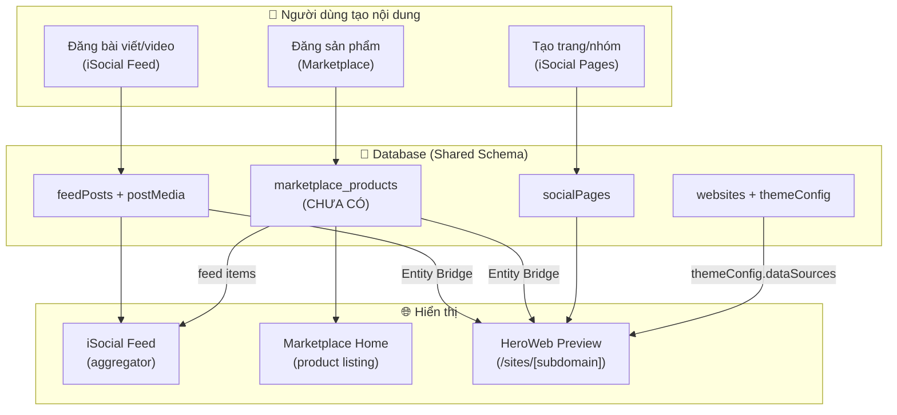

# UI_MAP — Bản Đồ Giao Diện Hệ Thống AI2Hero

> **Mục đích**: AI đọc file này để hiểu TOÀN BỘ giao diện, trang nào liên kết trang nào, data flow giữa các module, và design system chung. Cập nhật file này mỗi khi UI thay đổi.

---

## KIẾN TRÚC TỔNG — 3 MVP + Shared Core

```mermaid
graph TB
    subgraph SHARED["🧱 SHARED CORE"]
        AUTH["Auth / Session<br>(JWT, users, teams)"]
        DS["Design System<br>(globals.css, shadcn/ui)"]
        TOAST["Toast / Notifications"]
        TOPHEADER["TopHeader + UserAvatar"]
        APPSWITCHER["AppSwitcher (5 apps)"]
    end

    subgraph MVP1["🛡️ MVP1: iSocial"]
        direction TB
        S_LAYOUT["Social Layout<br>3-column (sidebar/feed/rightbar)"]
        S_FEED["/ — Bảng tin"]
        S_PROFILE["/profile/[id]"]
        S_FRIENDS["/friends"]
        S_REELS["/reels"]
        S_SCHEDULER["/scheduler — Lập lịch MXH"]
        S_GROUPS["/groups + /groups/[id]"]
        S_PAGES["/pages + /pages/[id]"]
        S_MESSAGES["/messages"]
        S_NOTIFICATIONS["/notifications"]
        S_FILM["/film — Phim Ngắn"]
        S_FILM_WATCH["/film/watch — Xem phim ngắn"]
        S_FILM_BOOKMARKS["/film/bookmarks — Phim đã lưu"]
        S_CHAT["Chat Dock (overlay)"]
    end

    subgraph MVP2["🛒 MVP2: HeroMarketplace"]
        direction TB
        M_LAYOUT["Marketplace Layout<br>(header + cart + search)"]
        M_HOME["/marketplace"]
        M_PRODUCT["/product/[id]"]
        M_SHOP["/shop/[id]"]
    end

    subgraph MVP3["🌐 MVP3: HeroWeb"]
        direction TB
        W_LAYOUT["HeroWeb Layout<br>(sidebar builder)"]
        W_STUDIO["/heroweb"]
        W_PREVIEW["/sites/[subdomain]"]
    end

    subgraph MVP4["🎬 MVP4: HeroVideoMaker"]
        direction TB
        VM_LAYOUT["Video Maker Layout<br>(sidebar + IDOR check)"]
        VM_DASHBOARD["/hero-video-maker/t/[teamId]/dashboard"]
        VM_PROJECTS["/hero-video-maker/t/[teamId]/projects"]
        VM_EDITOR["/hero-video-maker/t/[teamId]/editor/[id]"]
        VM_GALLERY["/hero-video-maker/t/[teamId]/gallery"]
        VM_DEVICES["/hero-video-maker/t/[teamId]/devices"]
        VM_SETTINGS["/hero-video-maker/t/[teamId]/settings"]
    end

    subgraph MVP8["🎬 MVP8: HeroFilm"]
        direction TB
        HF_LAYOUT["HeroFilm Layout<br>(sidebar + IDOR check)"]
        HF_DASHBOARD["/hero-film/t/[teamId]/dashboard — Phân tích KPI"]
        HF_SERIES["/hero-film/t/[teamId]/series — Quản lý phim"]
        HF_REVENUE["/hero-film/t/[teamId]/revenue — Báo cáo doanh thu"]
    end

    subgraph MVP9["🎬 MVP9: HeroDub"]
        direction TB
        HD_LAYOUT["HeroDub Layout<br>(sidebar + IDOR check)"]
        HD_DASHBOARD["/hero-dub/t/[teamId]/dashboard — Dịch phụ đề"]
        HD_GUIDE["/hero-dub/t/[teamId]/guide — Hướng dẫn Worker"]
    end

    subgraph MVP10["🎬 MVP10: HeroCocCoc"]
        direction TB
        HCC_LAYOUT["HeroCocCoc Layout<br>(sidebar + IDOR check)"]
        HCC_DASHBOARD["/hero-coccoc/t/[teamId]/dashboard — Tổng quan & Profiles"]
        HCC_PROJECTS["/hero-coccoc/t/[teamId]/projects — Dự án quét tải"]
        HCC_QUICK["/hero-coccoc/t/[teamId]/quick-download — Tải nhanh"]
        HCC_HISTORY["/hero-coccoc/t/[teamId]/history — Lịch sử hoạt động"]
        HCC_GUIDE["/hero-coccoc/t/[teamId]/guide — Hướng dẫn Worker"]
    end

    AUTH --> S_LAYOUT
    AUTH --> M_LAYOUT
    AUTH --> W_LAYOUT
    AUTH --> VM_LAYOUT
    AUTH --> HF_LAYOUT
    AUTH --> HD_LAYOUT
    AUTH --> HCC_LAYOUT
    DS --> S_LAYOUT
    DS --> M_LAYOUT
    DS --> W_LAYOUT
    DS --> VM_LAYOUT
    DS --> HF_LAYOUT
    DS --> HD_LAYOUT
    DS --> HCC_LAYOUT

    S_LAYOUT -->|"sidebar link"| M_HOME
    S_LAYOUT -->|"sidebar link"| W_STUDIO
    S_LAYOUT -->|"sidebar link"| VM_DASHBOARD
    S_LAYOUT -->|"sidebar link"| HF_DASHBOARD
    S_LAYOUT -->|"sidebar link"| HD_DASHBOARD
    S_LAYOUT -->|"sidebar link"| HCC_DASHBOARD
    M_LAYOUT -->|"back link"| S_FEED

    S_FEED -.->|"Entity Bridge:<br>sync posts"| W_PREVIEW
    S_PAGES -.->|"Entity Bridge:<br>sync page feed"| W_PREVIEW
    M_HOME -.->|"Entity Bridge:<br>sync products"| W_PREVIEW
    M_HOME -.->|"feed items"| S_FEED
    VM_DASHBOARD -.->|"Long Polling<br>Render Jobs"| R_APP["💻 Desktop Renderer<br>(Tauri/Electron)"]
    HD_DASHBOARD -.->|"Long Polling<br>API Tasks"| LW_APP["💻 Local Worker<br>(Python subprocess)"]
    HCC_DASHBOARD -.->|"Long Polling<br>API Tasks"| LCC_APP["💻 Cốc Cốc Local Worker<br>(Python Playwright)"]
```

---

## DESIGN SYSTEM CHUNG (Tiêu chuẩn cho cả 3 MVP)

### Fonts
- **Primary**: `Outfit` (Google Fonts) — set trong root layout
- **Fallback**: `Manrope, Arial, Helvetica, sans-serif` — set trong globals.css

### Brand Colors (HSL)
| Token | HSL | Dùng cho |
|---|---|---|
| `--hero-orange` | `24 95% 53%` | CTA chính, accent |
| `--hero-pink` | `330 81% 60%` | Secondary accent, active states |
| `--hero-gradient` | orange → pink (135°) | Buttons, badges, active indicators |
| `--hero-gradient-subtle` | gradient 10% opacity | Background highlights |

### Dark Theme (Forced — không có light mode)
| Token | Giá trị | Dùng cho |
|---|---|---|
| `--background` | `240 6% 4%` (#08080c) | Body background |
| `--foreground` | `0 0% 98%` | Text chính |
| `--card` | `240 4% 7%` | Card backgrounds |
| `--muted` | `240 4% 16%` | Disabled states, borders |
| `--border` | `240 4% 14%` | Borders chung |
| `--ring` | `24 95% 53%` (orange) | Focus rings |

### Spacing & Radius
- `--radius`: `0.6rem` (base)
- Sidebar width: `280px` (lg) / `320px` (xl)
- Feed max-width: `680px`
- Header height: `3.5rem` (56px)

### Animations (có sẵn cho cả 3 MVP)
`float`, `gradient-shift`, `fade-in`, `fade-up`, `pulse-glow`, `shimmer`, `count-up`, `scale-up`, `heart-pop`

### Shared UI Components (`components/ui/`)
| Component | File | Dùng bởi |
|---|---|---|
| Avatar | `avatar.tsx` | Cả 3 MVP |
| Button | `button.tsx` | Cả 3 MVP (6 variants, 4 sizes) |
| Card | `card.tsx` | Cả 3 MVP |
| DropdownMenu | `dropdown-menu.tsx` | Cả 3 MVP |
| Input | `input.tsx` | Cả 3 MVP |
| Label | `label.tsx` | Cả 3 MVP |
| RadioGroup | `radio-group.tsx` | Forms |
| Textarea | `textarea.tsx` | Forms |
| Toast | `toast.tsx` | Cả 3 MVP (custom, `window.showToast`) |

### Shared Components Cao Cấp
| Component | File | Dùng bởi |
|---|---|---|
| TopHeader | `components/top-header.tsx` (34.8KB) | Dashboard, HeroWeb, Social (exports `HeaderUserAvatar`) |
| AppSwitcher | `components/app-switcher.tsx` | Social TopNav |
| AuthModal | `components/auth-modal.tsx` | Social Layout (Google + Email) |
| ErrorBoundary | `components/error-boundary.tsx` | Bất kỳ module nào |
| CookieSync | `components/cookie-sync.tsx` | Social Layout |

---

## MVP1: iSocial (Social-Hero) — Chi Tiết

### Layout
- **File**: `app/(social)/(main)/social-layout.tsx`
- **Kiểu**: 3-column Facebook-like
  - Left sidebar (280-320px): `SocialSidebar` — nav chính
  - Center feed (max 680px): Nội dung trang
  - Right sidebar (280-320px, xl only): `SocialRightbar` — context-aware

### Navigation — Social Sidebar (`social-sidebar.tsx`)
| # | Label | Icon | Route | Auth? |
|---|---|---|---|---|
| 1 | Bảng tin | Home | `/` | No |
| 2 | Trang cá nhân | User | `/profile/{userId}` | Yes |
| 3 | Bạn bè | Users | `/friends` | Yes |
| 4 | Video Reels | Clapperboard | `/reels` | No |
| 5 | Lập lịch MXH | CalendarClock | `/scheduler` | Yes |
| 6 | **Marketplace** | Store | `/marketplace` | No |
| 7 | Nhóm | Users | `/groups` | No |
| 8 | Trang | Flag | `/pages` | No |
| 9 | Tin nhắn | MessageSquare | `/messages` | Yes |
| 10 | **Website của tôi** | Globe | `/heroweb` | No |
| 11 | Cài đặt | Settings | `/settings` | Yes |
| — | Vào Dashboard | ArrowLeft | `/dashboard/t/{teamId}` | Yes |

### Navigation — Social TopNav (`social-top-nav.tsx`)
- Left: Brand "AI2Hero" + "Social" badge + AppSwitcher
- Center: Global search (debounced) — **HOẶC** MarketplaceHeader khi ở /marketplace
- Right: Quick nav icons (Home, Friends, Messages) + Notifications + UserAvatar

### Trang & Chức Năng

#### `/` — Bảng tin (Feed)
- **Chức năng**: Hiển thị bài viết từ bạn bè, trang, nhóm đã follow
- **Vai trò**: Hub trung tâm — nơi aggregator nội dung từ toàn hệ thống
- **Đọc data từ**: `feedPosts`, `socialProfiles`, `socialFriends`, `socialPages`, `socialGroups`, `postMedia`
- **Ghi data**: Tạo post mới (`feedPosts` + `postMedia`)
- **Liên kết**: Profile, Groups, Pages, Marketplace (items trong feed), HeroWeb (posts sync)
- **Components**: `feed-post-creator.tsx` (42KB), `feed-post-card.tsx`, `story-reels.tsx`, `suggested-friends-box.tsx`, `suggested-reels-box.tsx`

#### `/profile/[userId]` — Trang cá nhân
- **Chức năng**: Xem/sửa profile, danh sách bài viết, ảnh, bạn bè
- **Vai trò**: Identity hub — mọi module đều link về đây
- **Đọc data từ**: `socialProfiles`, `feedPosts`, `socialFriends`, `users`
- **Ghi data**: Cập nhật `socialProfiles`
- **Liên kết**: Feed, Friends, HeroWeb (linkedProfileId)

#### `/friends` — Quản lý bạn bè
- **Chức năng**: Danh sách bạn bè, lời mời kết bạn, gợi ý
- **Đọc/ghi**: `socialFriends`, `users`
- **Liên kết**: Profile

#### `/reels` — Video Reels
- **Chức năng**: Xem video ngắn dạng swipe (full-screen mode)
- **Layout đặc biệt**: Full height (100vh - 3.5rem), ẩn right sidebar
- **Đọc data từ**: `feedPosts` (type=video), `postMedia`
- **Liên kết**: Feed, Profile, HeroWeb (reels sync)

#### `/scheduler` — Lập lịch MXH
- **Chức năng**: Lập lịch đăng bài hàng loạt lên nhiều kênh (Facebook Page, Facebook Reels, TikTok) từ thư viện feedPosts của team.
- **Vai trò**: Content Distribution Hub.
- **Đọc data từ**: `feedPosts`, `connectHubConnections`.
- **Ghi data**: `heroSocialSchedules`, `socialCrossPosts`.
- **Liên kết**: iSocial Feed, Connect Hub, Queue View.

#### `/groups` + `/groups/[groupId]`
- **Chức năng**: Tạo/quản lý nhóm, feed nhóm, thành viên
- **Đọc/ghi**: `socialGroups`, `socialGroupMembers`, `feedPosts` (groupId filter)
- **Liên kết**: Feed, Profile

#### `/pages` + `/pages/[pageId]`
- **Chức năng**: Tạo/quản lý trang (business pages), feed trang
- **Đọc/ghi**: `socialPages`, `socialPageFollowers`, `feedPosts` (pageId filter)
- **Liên kết**: Feed, Profile, **HeroWeb** (linkedPageId — trang có thể sync sang website)

#### `/messages`
- **Chức năng**: Nhắn tin realtime (direct + group)
- **Layout đặc biệt**: Full height, ẩn right sidebar
- **Đọc/ghi**: `socialConversations`, `socialConversationMembers`, `socialMessages`
- **Liên kết**: Profile, Friends

#### `/notifications`
- **Chức năng**: Xem danh sách thông báo hệ thống (bản mở rộng của dropdown chuông)
- **Đọc/ghi**: `notifications`
- **Liên kết**: Feed, Profile, Groups

### Right Sidebar — Context-Aware (`social-rightbar.tsx`)
| Trang đang xem | Hiển thị |
|---|---|
| Default (Feed, Profile) | Gợi ý bạn bè + Bạn online |
| Groups | Gợi ý nhóm + Nhóm của tôi |
| Pages | Gợi ý trang + Trang đang follow |
| Marketplace | Cửa hàng nổi bật + Sản phẩm hot |

---

## MVP2: HeroMarketplace — Chi Tiết

### Layout (HIỆN TẠI → CẦN TÁCH)
- **Hiện tại**: Nằm trong `(social)/(main)/` → dùng Social sidebar + layout
- **Mục tiêu**: Tạo route group `(marketplace)/` riêng với layout e-commerce
  - Header: Logo + Search bar + Categories + Cart icon + User avatar
  - **KHÔNG** có social sidebar (nhưng có link quay về iSocial)
  - Mobile-first, grid-based product listing

### Navigation — Marketplace Header (`components/marketplace/marketplace-header.tsx`)
- Search bar (prominently centered)
- Category navigation
- Cart icon + notification badge
- Link quay về "iSocial" / "Bảng tin"

### Trang & Chức Năng

#### `/marketplace` — Trang chủ Marketplace
- **Chức năng**: Browse sản phẩm, flash sale, categories, shops nổi bật
- **Vai trò**: E-commerce storefront — data consumer + aggregator
- **Đọc data từ**: `marketplace_products` (CHƯA CÓ — đang mock), `marketplace_shops` (CHƯA CÓ)
- **Ghi data**: Đơn hàng, giỏ hàng (chưa có)
- **Liên kết**: Product detail, Shop, iSocial feed (sản phẩm hiện trong feed)
- **Components**: `marketplace-banners.tsx`, `marketplace-categories.tsx`, `marketplace-flash-sale.tsx`, `marketplace-quick-links.tsx`, `marketplace-shopee-mall.tsx`, `marketplace-top-search.tsx`
- **Trạng thái**: 🔴 **100% Mock UI** — chưa có database

#### `/product/[id]` — Chi tiết sản phẩm
- **Chức năng**: Xem chi tiết, gallery, reviews, shop info, mua hàng
- **Đọc data từ**: `marketplace_products` (mock)
- **Liên kết**: Shop, Marketplace home, iSocial (chia sẻ lên feed), Checkout
- **Components**: `product-gallery.tsx`, `product-info.tsx`, `product-description.tsx`, `product-reviews.tsx`, `product-shop-snippet.tsx`

#### `/marketplace/checkout` — Thanh toán
- **Chức năng**: Hiển thị giỏ hàng, thông tin địa chỉ, đặt hàng
- **Đọc data từ**: `CartContext` (localStorage)
- **Ghi data**: `marketplace_orders`
- **Liên kết**: Order detail (`/marketplace/order/[id]`)

#### `/marketplace/order/[id]` — Chi tiết đơn hàng
- **Chức năng**: Hiển thị đơn hàng sau khi đặt thành công, trạng thái giao hàng
- **Đọc data từ**: `marketplace_orders`
- **Liên kết**: Marketplace home, Profile (Lịch sử đơn hàng)

#### `/shop/[id]` — Trang cửa hàng (CHƯA CÓ)
- **Mục tiêu**: Profile cửa hàng, danh sách sản phẩm, vouchers
- **Liên kết**: Profile iSocial (1 user = 1 shop), Products, HeroWeb (shop sync)
- **Components hiện có**: `shop-integrated-tab.tsx`, `shop-vouchers.tsx`

### Marketplace ↔ iSocial Integration Points
1. Social sidebar chứa link `/marketplace` (line 44)
2. Social TopNav swap thành MarketplaceHeader khi ở `/marketplace`
3. Right sidebar hiển thị "Cửa hàng nổi bật + Sản phẩm hot" khi ở Marketplace
4. Sản phẩm có thể được share lên Social Feed
5. Shop profile liên kết với Social Profile

---

## MVP3: HeroWeb (Web Studio) — Chi Tiết

### Layout
- **File**: `app/(dashboard)/heroweb/layout.tsx`
- **Kiểu**: Sidebar builder (w-60) + main content
- Auth guard: redirect `/sign-in` nếu chưa login

### Navigation — HeroWeb Sidebar
| # | Label | Route | Status |
|---|---|---|---|
| 1 | Tổng quan | `/heroweb` | ✅ Active |
| 2 | Kho Giao diện | `#` | 🔴 Chưa link |
| 3 | Cài đặt chung | `#` | 🔴 Chưa link |
| — | Về trang chủ AI2Hero | `/dashboard` | ✅ |

### Trang & Chức Năng

#### `/heroweb` — Dashboard Builder
- **Chức năng**: Quản lý websites, tạo mới, chọn template, config theme
- **Vai trò**: Orchestrator — kết nối data từ iSocial + Marketplace để tạo website
- **Đọc data từ**: `websites`, `socialPages` (qua linkedPageId), `socialProfiles` (qua linkedProfileId)
- **Ghi data**: `websites` (CRUD)
- **Liên kết**: Social Pages, Social Profiles, Marketplace Shops (tương lai)

#### `/sites/[subdomain]` — Public Website Preview
- **Chức năng**: Render website công khai theo subdomain
- **Vai trò**: Data consumer — hiển thị nội dung từ iSocial + Marketplace
- **Đọc data từ**: `websites` (config), `feedPosts` + `postMedia` (qua Entity Bridge), `marketplace_products` (qua Entity Bridge)
- **Liên kết**: iSocial (posts, reels), Marketplace (products)
- **Components**: `ecommerce-template.tsx` (12.7KB) — template chính
- **Trạng thái**: ⚠️ Đang dùng mock arrays (`mockProducts`, `mockPosts`, `mockReels`)
- **Routing đặc biệt**: Middleware rewrite subdomain → `/sites/[subdomain]`

### HeroWeb ↔ Other MVP Integration Points
1. `websites.linkedPageId` → `socialPages.id` (FK cứng — cần chuyển sang soft ref)
2. `websites.linkedProfileId` → `socialProfiles.userId` (FK cứng — cần chuyển sang soft ref)
3. Social sidebar chứa link `/heroweb` (line 68)
4. Website preview cần sync: posts + reels (từ iSocial), products (từ Marketplace)

---

## DATA FLOW DIAGRAM — Cross-Module

---

## COMPONENT MAP — Cái Gì Chung, Cái Gì Riêng

### ✅ CHUNG (Shared — dùng cho cả 3 MVP)
| Layer | Components | File |
|---|---|---|
| UI Primitives | Avatar, Button, Card, Input, Label, Toast, DropdownMenu | `components/ui/*` |
| Auth | AuthModal, CookieSync | `components/auth-modal.tsx`, `components/cookie-sync.tsx` |
| Header | TopHeader (export HeaderUserAvatar) | `components/top-header.tsx` |
| Navigation | AppSwitcher | `components/app-switcher.tsx` |
| Error | ErrorBoundary | `components/error-boundary.tsx` |
| Design | globals.css (tokens + animations) | `app/globals.css` |

### 🛡️ RIÊNG — MVP1: iSocial
| Components | Files |
|---|---|
| Social Layout (3-col) | `social-layout.tsx`, `social-sidebar.tsx`, `social-rightbar.tsx` |
| Social TopNav | `social-top-nav.tsx` |
| Feed System | `feed-post-creator.tsx`, `components/feed-post/*` (8 files) |
| Story/Reels | `story-creator-modal.tsx`, `story-reels.tsx`, `story-viewer-modal.tsx` |
| Suggestions | `suggested-friends-box.tsx`, `suggested-reels-box.tsx` |
| Chat | `components/chat-dock.tsx`, `chat-popup.tsx` |
| Groups/Pages | `group-card.tsx`, `message-button.tsx` |

### 🛒 RIÊNG — MVP2: HeroMarketplace
| Components | Files |
|---|---|
| Marketplace Header | `components/marketplace/marketplace-header.tsx` |
| Home Sections | `marketplace-banners.tsx`, `marketplace-categories.tsx`, `marketplace-flash-sale.tsx`, `marketplace-quick-links.tsx`, `marketplace-shopee-mall.tsx`, `marketplace-top-search.tsx` |
| Product Detail | `components/marketplace/product/*` (5 files) |
| Shop | `components/marketplace/shop/*` (2 files) |

### 🌐 RIÊNG — MVP3: HeroWeb
| Components | Files |
|---|---|
| HeroWeb Layout | `app/(dashboard)/heroweb/layout.tsx` (inline sidebar) |
| Website Templates | `components/website-templates/ecommerce-template.tsx` |
| Website Preview | `app/(public)/sites/[subdomain]/page.tsx` |

### 🎬 RIÊNG — MVP4: HeroVideoMaker
| Components | Files |
|---|---|
| Video Maker Layout | `app/(dashboard)/hero-video-maker/t/[teamId]/layout.tsx` (IDOR check) |
| Video Maker Sidebar | `app/app/(dashboard)/hero-video-maker/hero-video-maker-sidebar.tsx` |
| Pairing Widget | `app/app/(dashboard)/hero-video-maker/t/[teamId]/dashboard/pairing-widget.tsx` |

---

## MVP4: HeroVideoMaker (Video AI tự động) — Chi Tiết

### Layout
- **File**: `app/(dashboard)/hero-video-maker/t/[teamId]/layout.tsx`
- **Kiểu**: Sidebar dọc (w-60) + header và IDOR workspace check.
- Auth guard: redirect `/sign-in` nếu chưa đăng nhập.

### Navigation — HeroVideoMaker Sidebar (`hero-video-maker-sidebar.tsx`)
| # | Label | Icon | Route | Auth? |
|---|---|---|---|---|
| 1 | Tổng quan | LayoutDashboard | `/hero-video-maker/t/[teamId]/dashboard` | Yes |
| 2 | Dự án video | Video | `/hero-video-maker/t/[teamId]/projects` | Yes |
| 3 | Thư viện đã tạo | Film | `/hero-video-maker/t/[teamId]/gallery` | Yes |
| 4 | Thiết bị & App Local | Laptop | `/hero-video-maker/t/[teamId]/devices` | Yes |
| 5 | Cấu hình & Storage | Settings | `/hero-video-maker/t/[teamId]/settings` | Yes |

### Trang & Chức Năng

#### `/hero-video-maker/t/[teamId]/dashboard` — Bảng điều khiển chính
- **Chức năng**: Quản lý kết nối tới local renderer app, hiển thị stats dự án, video đã render, danh sách thiết bị.
- **Vai trò**: Control center cho việc tạo video local.
- **Đọc data từ**: `extensionTokens`, `videoProjects` (tương lai).
- **Ghi data**: Sinh mã code liên kết (`extensionLinkCodes`).
- **Liên kết**: Editor, Projects List, Gallery, Connect Hub (Google Drive connection).

#### `/hero-video-maker/t/[teamId]/projects` — Quản lý dự án video
- **Chức năng**: Xem danh sách dự án, mở editor của dự án, và khởi tạo dự án mới qua Modal Cài đặt & Sổ tay Đạo diễn.
- **Vai trò**: Quản lý vòng đời dự án video.
- **Đọc data từ**: `videoProjects`, `presets.json` (Art Styles & Story Skills preset list).
- **Ghi data**: Khởi tạo bản ghi mới trong bảng `videoProjects` với prompt resolve từ preset hoặc tự nhập.
- **Liên kết**: Editor (`/editor/[projectId]`).

---

## MVP9: HeroDub (Dịch & Burn phụ đề phim) — Chi Tiết

### Layout
- **File**: `app/(dashboard)/hero-dub/t/[teamId]/layout.tsx`
- **Kiểu**: Sidebar dọc (w-60) + header và IDOR workspace check.
- Auth guard: redirect `/sign-in` nếu chưa đăng nhập.

### Navigation — HeroDub Sidebar (`hero-dub-sidebar-menu.tsx`)
| # | Label | Icon | Route | Auth? |
|---|---|---|---|---|
| 1 | Tổng quan | LayoutDashboard | `/hero-dub/t/[teamId]/dashboard` | Yes |
| 2 | Hướng dẫn Worker | HelpCircle | `/hero-dub/t/[teamId]/guide` | Yes |

### Trang & Chức Năng

#### `/hero-dub/t/[teamId]/dashboard` — Bảng điều khiển chính
- **Chức năng**: Quản lý các worker local, tạo tác vụ dịch video từ link, xem danh sách và trạng thái xử lý video.
- **Vai trò**: Control center cho dịch thuật phụ đề.
- **Đọc data từ**: `dubTasks`, `dubWorkers`.
- **Ghi data**: Tạo tác vụ dịch (`dubTasks`), sinh mã kết nối worker (`extensionLinkCodes`).
- **Liên kết**: Guide page, R2 Storage public URL (tải kết quả).

#### `/hero-dub/t/[teamId]/guide` — Hướng dẫn cài đặt
- **Chức năng**: Cung cấp tài liệu hướng dẫn từng bước để tải pyVideoTrans và script worker local, giúp user tự host máy xử lý.
- **Vai trò**: Tài liệu / Hướng dẫn.
- **Liên kết**: Dashboard page.

---

## ROUTE SUMMARY — Tổng Hợp 4 MVP

### MVP1: iSocial — Route Group `(social)/(main)`
| Route | Trạng thái |
|---|---|
| `/` | ✅ Beta |
| `/profile/[userId]` | ✅ Beta |
| `/friends` | ✅ Beta |
| `/reels` | ✅ Beta |
| `/scheduler` | ✅ Beta |
| `/groups`, `/groups/[groupId]`, `/groups/discover` | ✅ Beta |
| `/pages`, `/pages/[pageId]` | ✅ Beta |
| `/messages` | ✅ Beta |

### MVP2: HeroMarketplace — Cửa hàng & Quản lý MVP (Admin Panel)
| Route | Trạng thái |
|---|---|
| `/marketplace` | ✅ Beta (Storefront, giỏ hàng, đặt hàng thực) |
| `/product/[id]` | ✅ Beta (Chi tiết sản phẩm, shop snippet thực) |
| `/marketplace/checkout` | ✅ Beta (Form checkout lưu DB thực) |
| `/marketplace/order/[id]` | ✅ Beta (Chi tiết đơn hàng sau thanh toán) |
| `/hero-marketplace/t/[teamId]/dashboard` | ✅ Beta (Quản trị Marketplace: tổng quan KPI, top orders/products thực) |
| `/hero-marketplace/t/[teamId]/products` | ✅ Beta (Quản lý Sản phẩm: SKU, costPrice, minStock, AI restock) |
| `/hero-marketplace/t/[teamId]/orders` | ✅ Beta (Quản lý Đơn hàng: filters, status, detail sheet, print) |
| `/hero-marketplace/t/[teamId]/fulfillment` | ✅ Beta (Fulfillment: Quét mã vạch, Đóng gói quay video) |
| `/hero-marketplace/t/[teamId]/wallet` | ✅ Beta (Ví tiền thanh toán, nạp tiền PayOS/MoMo) |

### MVP3: HeroWeb — Route Group `(dashboard)/heroweb` + `(public)/sites`
| Route | Trạng thái |
|---|---|
| `/heroweb` | ⚠️ Beta (có DB, UI đơn giản) |
| `/sites/[subdomain]` | ⚠️ Beta (mock data arrays) |
| `/sites/demo` | ✅ Demo |

### MVP4: HeroVideoMaker — Route Group `(dashboard)/hero-video-maker`
| Route | Trạng thái |
|---|---|
| `/hero-video-maker/t/[teamId]/dashboard` | ✅ Beta (Bảng điều khiển kết nối app local, stats) |
| `/hero-video-maker/t/[teamId]/projects` | ✅ Beta (Quản lý các dự án video) |
| `/hero-video-maker/t/[teamId]/editor/[projectId]/[step]` | ✅ Beta (Trình soạn thảo quy trình 6 bước Toonflow) |
| `/hero-video-maker/t/[teamId]/gallery` | ✅ Beta (Thư viện video thành phẩm) |
| `/hero-video-maker/t/[teamId]/devices` | ✅ Beta (Danh sách thiết bị kết nối) |
| `/hero-video-maker/t/[teamId]/settings` | ✅ Beta (Cài đặt lưu trữ Drive/Local) |

### MVP8: HeroFilm — Trình phát & Quản lý Phim Ngắn Dọc
| Route | Đối tượng | Chức năng | Trạng thái |
|---|---|---|---|
| `/film` | Viewer (Public) | Khám phá phim ngắn, chọn thể loại, tìm kiếm phim | ✅ Beta |
| `/film/watch` | Viewer (Public) | Xem phim snap-scroll dọc, mở khóa tokens, watch history, bookmarks | ✅ Beta |
| `/film/bookmarks` | Viewer (Public) | Danh sách các phim ngắn mà viewer đã đánh dấu/lưu | ✅ Beta |
| `/hero-film/t/[teamId]/dashboard` | Creator (Workspace) | Trang tổng quan số liệu KPI phân tích lượt xem và tokens | ✅ Beta |
| `/hero-film/t/[teamId]/series` | Creator (Workspace) | Quản lý CRUD các bộ phim ngắn của team | ✅ Beta |
| `/hero-film/t/[teamId]/series/[id]/episodes` | Creator (Workspace) | Quản lý CRUD tập phim, upload link, xem báo cáo hỏng tập | ✅ Beta |
| `/hero-film/t/[teamId]/reports` | Creator (Workspace) | Quản lý, kiểm duyệt các báo cáo lỗi phim gửi từ người xem | ✅ Beta |
| `/hero-film/t/[teamId]/revenue` | Creator (Workspace) | Báo cáo doanh thu Tokens chi tiết, nhật ký giao dịch và chia sẻ 70/30 | ✅ Beta |

### MVP9: HeroDub — Dịch & Burn phụ đề phim
| Route | Đối tượng | Chức năng | Trạng thái |
|---|---|---|---|
| `/hero-dub/t/[teamId]/dashboard` | Creator (Workspace) | Quản lý tác vụ dịch, xem video kết quả, kết nối worker local | ✅ Beta |
| `/hero-dub/t/[teamId]/guide` | Creator (Workspace) | Tài liệu hướng dẫn cài đặt local worker & pyVideoTrans | ✅ Beta |

### MVP10: HeroCocCoc — Tự động cào và tải video qua Cốc Cốc
| Route | Đối tượng | Chức năng | Trạng thái |
|---|---|---|---|
| `/hero-coccoc/t/[teamId]/dashboard` | Creator (Workspace) | Quản lý KPIs, trạng thái worker, quản lý các Profile Cốc Cốc local | ✅ Beta |
| `/hero-coccoc/t/[teamId]/projects` | Creator (Workspace) | Quản lý dự án quét tải, cấu hình chu kỳ quét, bộ lọc, giới hạn, dynamic sources | ✅ Beta |
| `/hero-coccoc/t/[teamId]/quick-download` | Creator (Workspace) | Tải nhanh danh sách video tức thì bằng dán links | ✅ Beta |
| `/hero-coccoc/t/[teamId]/history` | Creator (Workspace) | Xem lịch sử tải, xem log timeline chẩn đoán chi tiết của từng task | ✅ Beta |
| `/hero-coccoc/t/[teamId]/guide` | Creator (Workspace) | Hướng dẫn cài đặt Cốc Cốc Local Worker, CMD 1-click installer | ✅ Beta |

### 🧩 Chrome Extensions & Edge Worker Node Routes
| MVP / Extension | Thư mục nguồn | API Routes | Trạng thái |
|---|---|---|---|
| **HeroSim** | `/app/extension/herosim/` | `/api/sim/extension/*` | ✅ Beta |
| **HeroVideo** | `/app/extension/herovideo/` | `/api/video/extension/*` | ✅ Beta |
| **Hero Agent** | `/app/extension/hero-agent/` | `/api/agent-node/extension/*` | ✅ Beta |
| **HeroDub Worker** | `/herodub-worker/` | `/api/hero-dub/*` | ✅ Beta |

**Các API Routes của Hero Agent (`appId: hero-agent`):**
- `GET /api/agent-node/extension/tasks`: Extension lấy danh sách task cào đang chờ (`pending`).
- `POST /api/agent-node/extension/result`: Extension đẩy nội dung cào về, server tự động gọi AI phân tích và lưu kết quả. (Hỗ trợ cào thủ công với `taskId = 0`).
- `GET /api/agent-node/extension/health`: Kiểm tra sức khỏe kết nối từ extension.
- `POST /api/agent-node/extension/scrape`: Web UI tạo task cào mới (Session Auth).

**Các API Routes của HeroDub Worker (`appId: hero-dub`):**
- `POST /api/hero-dub/workers`: Đăng ký và liên kết worker local sử dụng code 6 chữ số.
- `GET /api/hero-dub/tasks`: Worker poll lấy tác vụ pending.
- `PATCH /api/hero-dub/tasks`: Worker cập nhật trạng thái/tiến trình hoặc hoàn thành tác vụ.
- `POST /api/hero-dub/tasks`: Gửi heartbeat cập nhật trạng thái online của worker.
- `POST /api/hero-dub/presign`: Worker yêu cầu presigned URL của R2 để tải video/srt lên.
- `PUT /api/hero-dub/local-upload`: Fallback upload local khi dev offline không có R2.

**Các API Routes của Cốc Cốc Worker (`appId: hero-coccoc`):**
- `POST /api/hero-coccoc/workers`: Đăng ký và liên kết worker sử dụng code 6 chữ số.
- `GET /api/hero-coccoc/tasks`: Worker poll lấy tác vụ pending (ưu tiên tải nhanh).
- `PATCH /api/hero-coccoc/tasks`: Worker cập nhật trạng thái tác vụ (`scanning`, `downloading`, `completed`, `failed`).
- `GET /api/hero-coccoc/scan-configs`: Worker lấy các dự án cần quét cào.
- `POST /api/hero-coccoc/tasks/create-from-worker`: Worker gửi danh sách video URLs cào được để tạo tác vụ tải pending.

---

## QUY TẮC CẬP NHẬT UI_MAP

1. **Thêm trang mới** → Ghi đủ 4 mục: Chức năng, Vai trò, Đọc/Ghi data, Liên kết
2. **Đổi navigation** → Cập nhật bảng Navigation tương ứng
3. **Thêm component** → Phân loại Chung vs Riêng, ghi vào Component Map
4. **Thay đổi data flow** → Cập nhật Data Flow Diagram
5. **Thêm design token** → Cập nhật Design System section
